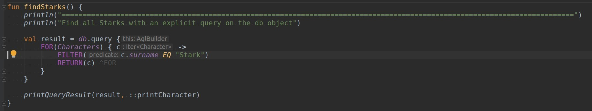

# Auto reload

In one terminal do

> ./gradlew -t build -x test

In another terminal do

> ./gradlew run 

# Karango

This repo has become the testbed for Karango. 

**ArangoDB** is a no-sql document and graph-database.
And **Karango** is a library for query Arangodb in a typesafe manner.

Goal of Karango is to fully implement AQL (ArangoDBs query language) as a typesafe Kotlin DSL.

All of this looks somehow like this:




Sorry! There is no documentation right now. Also there is some "noise" in this repo. Karango will get a dedicated repo soon.

If you are interested on how ArangoDBs query langugage is implemented as a Kotlin DSL feel free to look around here:
[Karango code base](./karango)

If you want to see it in action, check out the examples:
- [Game of thrones](./src/karango/examples/game_of_thrones)
- [Movies and Actors](./src/karango/examples/movies_and_actors)


## Stuff

### Better ReCSS

```
javascript:void(function(){var i,a,s;a=document.getElementsByTagName('link');for(i=0;i<a.length;i++){s=a[i];if(s.rel.toLowerCase().indexOf('stylesheet')>=0&&s.href&&s.href.indexOf('blob:')===-1) {var h=s.href.replace(/(&|%5C?)forceReload=\d+/,'');s.href=h+(h.indexOf('?')>=0?'&':'?')+'forceReload='+(new Date().valueOf())}}})();
```
